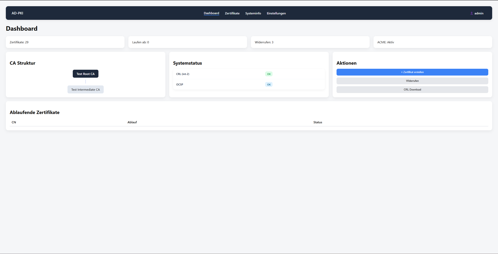
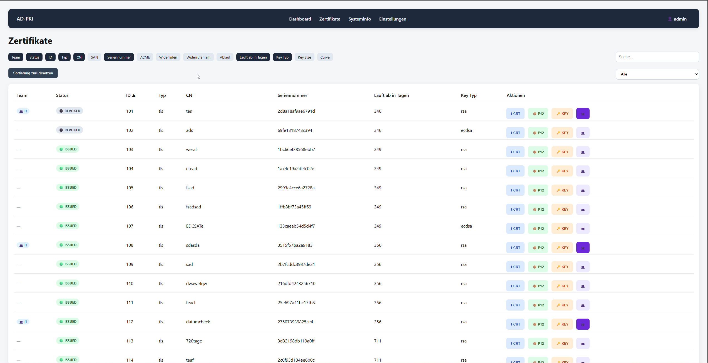
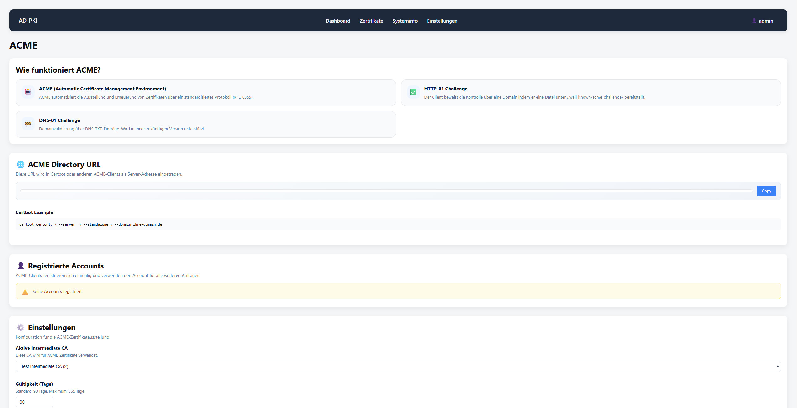

# AD-PKI Frontend

> Web-Oberfläche zur Verwaltung einer internen Public-Key-Infrastruktur (PKI) mit Zertifikaten, Certificate Authorities, ACME, Benutzern und Audit-Logs.

[](https://vuejs.org/)
[](https://www.typescriptlang.org/)
[](https://vitejs.dev/)
[](LICENSE)

[English](README.md) · **Deutsch**

## Übersicht

AD-PKI Frontend ist die Benutzeroberfläche für eine selbst betriebene PKI-Lösung. Sie ist bewusst als reine UI-Schicht aufgebaut: Geschäftslogik, Berechtigungsprüfungen und Zertifikatserzeugung laufen vollständig im Backend. Das Frontend konsumiert ausschließlich dessen REST-API und WebSocket-Events.

Die Anwendung erfordert eine kompatible Backend-API mit REST-Endpunkten für Zertifikate, CAs, Benutzer, Einstellungen und ACME sowie Broadcasting-Unterstützung. Das Backend selbst ist nicht Teil dieses Repositories.

## Screenshots

### Dashboard



Zentrale Übersicht über Zertifikate, CA-Status und Systeminformationen.

### Zertifikatsübersicht



Verwaltung, Suche und Übersicht aller ausgestellten Zertifikate.

### ACME



Verwaltung von ACME-Einstellungen, Accounts und automatisierter Zertifikatsausstellung.

## Features

- **Zertifikatsverwaltung** — TLS-, Client- und Code-Signing-Zertifikate erstellen, anzeigen, herunterladen und sperren
- **Certificate Requests** — Antrags- und Freigabe-Workflow für Zertifikate
- **CA-Verwaltung** — Root- und Intermediate-CAs verwalten
- **ACME-Unterstützung** — ACME-Accounts, Domains und Directory-URL einsehen und verwalten
- **PKI-Infrastruktur** — CRL-, OCSP-, TSA- und ACME-URLs zentral anhand einer Basis-URL konfigurieren
- **Benutzer, Teams und Rollen (RBAC)** — Feingranulare Berechtigungen zur Steuerung von Navigation und Routing
- **Audit-Logs** — Durchsuchbares Protokoll sicherheitsrelevanter Aktionen
- **Echtzeit-Benachrichtigungen** — Live-Toasts bei Zertifikatsereignissen, Änderungen des CA-Zustands und weiteren Ereignissen über WebSocket
- **Benachrichtigungskanäle** — Webhook- und Bot-Benachrichtigungen konfigurieren
- **Branding** — Anpassbarer Firmenname und anpassbares Farbschema
- **Mehrsprachigkeit** — Deutsch, Englisch, Französisch, Italienisch, Spanisch und Türkisch
- **Sicherheits- und ACL-Einstellungen**, Systemstatusübersicht und Benutzerprofil

## Architektur

```text
Vue 3 Frontend  →  Backend-API  →  Certificate-Authority-Dienst
   (dieses Repo)     (REST/WS)        (Crypto-Engine)
```

Das Frontend übernimmt ausschließlich Darstellung und Interaktion. Die Authentifizierung gegenüber der Backend-API erfolgt tokenbasiert. Echtzeit-Updates wie Audit-Events und Änderungen des CA-Zustands werden über WebSocket-Broadcasting empfangen.

Eine ausführliche technische Beschreibung findest du in [`docs/FRONTEND.md`](docs/FRONTEND.md).

## Tech-Stack

| Bereich | Technologie |
| --- | --- |
| Framework | [Vue 3](https://vuejs.org/) (Composition API, `<script setup>`) |
| Sprache | TypeScript (Strict Mode) |
| Build-Tool | [Vite](https://vitejs.dev/) |
| Routing | [Vue Router](https://router.vuejs.org/) |
| Internationalisierung | [vue-i18n](https://vue-i18n.intlify.dev/) |
| HTTP-Client | [Axios](https://axios-http.com/) |
| Echtzeit / WebSocket | [Laravel Echo](https://github.com/laravel/echo) und [Pusher JS](https://github.com/pusher/pusher-js) (Broadcasting-Client) |
| Event-Bus | [mitt](https://github.com/developit/mitt) |
| State-Management | Eigene reaktive Stores auf Basis der Vue-Reactivity-API (kein externes State-Management-Framework) |

## Erste Schritte

### Voraussetzungen

- Node.js (aktuelle LTS-Version empfohlen) und npm
- Eine erreichbare Backend-API, die das von diesem Frontend erwartete Endpunktschema bereitstellt

### Installation

```bash
git clone https://github.com/alid-it/AD-PKI-Frontend.git
cd AD-PKI-Frontend
npm install
```

### Konfiguration

Die API-Basis-URL wird zur Laufzeit über `public/config.js` konfiguriert, nicht über Build-Time-Variablen. Lege `public/config.js` mit folgendem Inhalt an:

```js
window.__ADPKI_CONFIG__ = {
  apiBaseUrl: "http://localhost:8000/api"
};
```

Ist die Datei nicht vorhanden, verwendet die Anwendung `http://localhost:8000/api` als Fallback. Details und Hintergrundinformationen findest du in [`docs/FRONTEND.md`](docs/FRONTEND.md#runtime-konfiguration).

### Verfügbare Skripte

| Befehl | Beschreibung |
| --- | --- |
| `npm run dev` | Entwicklungsserver mit Hot-Reload starten |
| `npm run build` | Produktions-Build in `dist/` erstellen |
| `npm run preview` | Produktions-Build lokal als Vorschau anzeigen |

## Projektstruktur

```text
src/
├── api/            # Ein Axios-basiertes Modul pro Backend-Ressource
├── components/     # UI-Komponenten (auth, common, layout, production)
├── views/          # Routenebene (auth, production)
├── router/         # Vue-Router-Konfiguration mit Auth- und Permission-Guards
├── stores/         # Leichte reaktive Stores (Auth, Toasts)
├── i18n/, locales/ # Mehrsprachigkeit
├── types/          # TypeScript-Typdefinitionen
├── utils/          # Hilfsfunktionen (Auth, Permissions, Event-Bus, i18n-Fehlermapping)
└── echo.ts         # WebSocket-/Broadcasting-Client
```

## Mitwirken

Issues und Pull Requests sind willkommen. Beschreibe Änderungen nachvollziehbar und halte dich an den bestehenden Code-Stil: TypeScript im Strict Mode und die Composition API mit `<script setup>`.

## Lizenz

Dieses Projekt steht unter der **GNU Affero General Public License v3.0 (AGPL-3.0)**. Den vollständigen Lizenztext findest du in [LICENSE](LICENSE).
